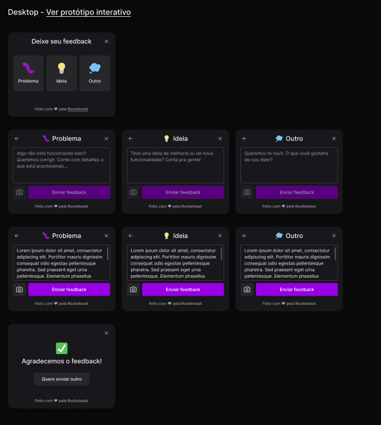

# Feedback-Widget
<br>
<br>

**Descrição**

Community for feedback on projects.



------------------------------

<br>

### Tecnologias usadas

<div style="display: flex; justify-content: space-between">
  
  
  
  
  
  
  
</div>

------------------------------
<br>

### Melhorias 

<ol>
  <li>
    Tema light/dark
  </li>
  <li>
    Em produção usar algum serviço de e-mai
  </li>
  <li>
    Melhorar HTML/CSS do e-mail
  </li>
  <li>
    Dashboard de feedbacks
    <ul>
      <li>
        Autenticação (Firebase / OAuth)
      </li>
    </ul>
  </li>
  <li>
    Validação de campos / erros
  </li>
</ol>

--------------------------
#### Ambiente linux
<br>

```bash
  
  git clone https://github.com/Junior030/Feedback-Widget.git

  cd Feedback-Widget
  
  npm run start

``` 
#### Outros ambientes 
<br>

* Back-end
```bash
  git clone https://github.com/Junior030/Feedback-Widget.git

  cd Feedback-Widget/server

  npm run dev

```
<br>

  * Front-end
```bash
  git clone https://github.com/Junior030/Feedback-Widget.git

  cd Feedback-Widget/web

  npm run dev

```
<br>

---------------------


## **Contato:**

[](https://api.whatsapp.com/send?phone=5537999069725)
[](https://www.linkedin.com/in/juniorhenrique030/)

**Desenvolvido por Junior Henrique** 🌟️